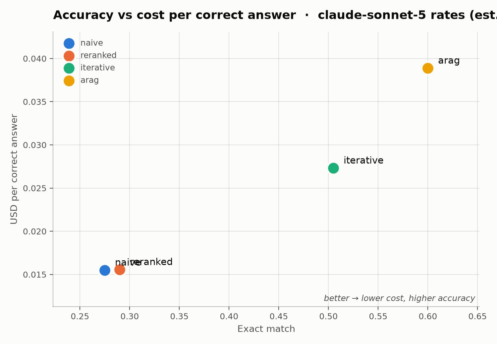

# rag-cost-curve

**A measured cost-per-correct-answer benchmark for agentic RAG, iterative RAG,
cross-encoder reranking and naive RAG — on multi-hop question answering.**


**What does agentic RAG actually cost per correct answer?**

A-RAG ([arXiv:2602.03442](https://arxiv.org/abs/2602.03442)) reports a 21-point
accuracy gain over naive RAG on MuSiQue at "comparable" token cost — 5,663
retrieved tokens against naive RAG's 5,387.

That comparison is narrower than it looks. The paper's Table 3 counts
**retrieved tokens**: corpus text pulled into the prompt. It does not report
total prompt tokens, completion tokens, number of LLM calls, or latency, and it
makes no total-cost comparison against naive RAG anywhere.

Naive RAG is one embed and one generation. A ReAct loop is a model call per
step, each one resending the accumulated history. Those are not the same bill.
This repo measures the missing axis: **USD per correct answer**, same corpus,
same queries, same model, four architectures.

---

## Results

200 MuSiQue queries · 3,327-chunk pooled corpus · 800 system-query pairs

| system | EM | 95% CI | F1 | $/query | **$/correct** | calls | retr. unique | retr. billed | p50 ms |
|---|---:|---:|---:|---:|---:|---:|---:|---:|---:|
| `naive` | 0.275 | 0.215–0.335 | 0.381 | 0.0043 | **0.0155** | 1.0 | 570 | 570 | 2035 |
| `reranked` | 0.290 | 0.225–0.355 | 0.389 | 0.0045 | **0.0156** | 1.0 | 579 | 579 | 7062 |
| `iterative` | 0.505 | 0.435–0.570 | 0.631 | 0.0138 | **0.0273** | 2.9 | 1402 | 1623 | 6962 |
| `arag` | 0.600 | 0.530–0.670 | 0.743 | 0.0233 | **0.0389** | 5.0 | 1561 | 2727 | 8704 |



Paired bootstrap, 2,000 resamples, same 200 questions per system:

| comparison | challenger wins |
|---|---:|
| `arag` > `naive` | 100.0% |
| `iterative` > `naive` | 100.0% |
| `arag` > `reranked` | 100.0% |
| `iterative` > `reranked` | 100.0% |
| `arag` > `iterative` | 99.7% |
| `reranked` > `naive` | **73.7%** |

### 1. Agentic RAG costs 2.5× more per correct answer

A-RAG buys **+32.5 EM** over naive RAG and costs **2.5×** more for each correct
answer it produces. Both halves are real; only the first gets published.

### 2. The cost curve has a knee, and it is not where the paper looks

Most of the gain is from retrieving *more than once*, not from the agent
steering retrieval:

- `naive` → `iterative`: **+23.0 EM** for 2.9× the calls
- `iterative` → `arag`: **+9.5 EM** for a further 1.7×

`iterative` is a fixed, code-controlled retrieve→read→retrieve loop — the model
writes the next query but never chooses a strategy. It reaches **84% of arag's
gain for 58% of the calls.** The ReAct loop is still doing real work (`arag`
wins 99.7% of paired resamples), so this is diminishing returns, not ceremony —
but a system that needs the accuracy and not the bill should look here first.

### 3. Negative result: reranking did not help

A cross-encoder reranker over 50 candidates gave **+1.5 EM** — it wins only
73.7% of paired resamples, which is noise at n=200. On this corpus, reranking a
bi-encoder's candidates is not where the accuracy is. Reported because it is
the baseline agentic-RAG comparisons usually skip, and it did not survive
being measured.

### The resend gap

`retrieved_unique` is distinct corpus text ever seen — the paper's metric.
`retrieved_billed` is the same text summed over every call that resent it.

```
naive       570 unique  ->    570 billed   (1.00x)
iterative  1402 unique  ->   1623 billed   (1.16x)
arag       1561 unique  ->   2727 billed   (1.75x)
```

Single-shot systems have no gap by construction. The agent pays for its context
1.75 times over. That column does not exist in the paper.

---

## The systems

All four share one index, one model, one `k`, one effort level, one caching
setting, and the same answer-format instruction. Only the retrieval strategy
varies.

| system | LLM calls | what it does |
|---|---|---|
| `naive` | 1 | embed the question, top-k, generate. The control. |
| `reranked` | 1 | bi-encoder proposes 50, cross-encoder picks k |
| `iterative` | ~3 | fixed retrieve→read→retrieve, hop count fixed in code |
| `arag` | ~5 | keyword + semantic + chunk-read tools, ReAct loop, context tracker |

---

## How the measurement works

**Every model call goes through `Meter.generate`.** Systems never report their
own usage; the meter reads it off the API response. An agent loop cannot
under-report by forgetting to instrument step 5.

**Input tokens are four buckets, not one.** Cache reads price at ~0.1× and cache
writes at ~1.25×. An agent resending history every step is mostly cache reads.
Pricing all input at 1.0× overstates agentic cost several-fold.

**Snippets cost less than chunks.** Search returns snippets billed at snippet
length; only an explicit `chunk_read` pays for full text. The hierarchical-
interface claim is untestable otherwise.

**Scoring is EM + token F1, SQuAD-normalized. No LLM judge.** A judge makes every
number arguable. Anyone with the dataset and a text editor can reproduce this.

**Accuracy ships with a bootstrap CI**, and comparisons are *paired* over the
shared query set — both systems answered the same questions.

**Latency excludes cache-served queries.** A replayed run has latency 0.

**Failures stay in the denominator.** Errored and budget-exhausted queries cost
money and failed to answer. Dropping them flatters whichever system is flakiest.

---

## Honest limits

**Costs are estimated, not billed.** The run executed on a free model
(`gpt-5.6-luna`); dollar columns are computed from the recorded token buckets at
`claude-sonnet-5` rates via `--price-as`. Token counts come from that model's
tokenizer, so **the ratios between systems are solid** — one tokenizer, one run,
four systems — while the absolute dollars are illustrative. The ordering is
unchanged at Opus-5 and Haiku-4.5 rates; only the multiplier moves.

**Absolute accuracy is low** (0.275 for naive vs ~0.52 published). This is
open-domain retrieval over one pooled 3,327-chunk corpus, not MuSiQue's
per-question 20-paragraph setting. The ordering transfers; the absolute numbers
do not.

**Multi-hop QA only.** No fact verification, dialogue, or long-form generation.

**Local compute is not priced.** The cross-encoder in `reranked` is free in
dollars here but not on your GPU bill.

**One implementation of A-RAG.** A better prompt or a different step budget
would move its numbers. It is in `systems/arag.py`; argue with it there.

**A measurement bug found mid-run, and what it cost.** `iterative`'s planner was
capped at 128 tokens; a reasoning model spent that budget thinking and emitted
nothing, silently collapsing the multi-hop loop to a single round. That
understated `iterative` by **7.5 EM** (0.430 → 0.505). Fixed in `iterative.py`,
and the meter no longer lets a deliberately capped auxiliary call set a query's
terminal state. Pre-fix data is kept at
`runs/luna200_musique/*.bak-preplannerfix`.

---

## Reproduce

```bash
pip install anthropic numpy sentence-transformers pyyaml matplotlib
export ANTHROPIC_API_KEY=...        # or: ant auth login
```

Download MuSiQue (`musique_ans_v1.0_dev.jsonl`) into `data/raw/`. Measured on
that file: 2,417 answerable queries, 21,100 unique documents, ~7,400 chunks.

```bash
# 1. Build the frozen index. Scope the corpus to the queries the run samples --
#    same N and seed -- or the gold paragraphs are missing from the index.
python -m rcc.build_index --config configs/corpus.yaml --for-queries 200 --seed 0

# 2. See the plan without spending anything.
python -m rcc.runner configs/run.yaml --dry-run

# 3. Run the sweep. Resumable: rerun after a crash and it skips finished work.
python -m rcc.runner configs/run.yaml

# 4. Table, bootstrap comparisons, charts.
python -m rcc.report runs/<run_id>

# Estimate cost at another model's rates from the recorded token buckets.
python -m rcc.report runs/<run_id> --price-as claude-sonnet-5
```

---

## Reproducibility

- **No `temperature=0`.** Sampling params are rejected on current Claude models.
  Determinism comes from an on-disk response cache keyed by the exact request,
  so re-scoring after a bug fix costs nothing and never re-spends.
- **The config is copied into the run directory before any spending starts.**
- **A typo in `run.yaml` raises** rather than falling back to a default and
  changing the experiment without changing the recorded config.
- **The index refuses to load under mismatched settings** (`config_hash`).
- **Pricing lives in `configs/pricing.yaml` with a `fetched_on` date.**

---

## Questions this answers

### Is agentic RAG worth the cost?

On multi-hop QA, yes — but the margin is narrower than the accuracy number
suggests. A-RAG scores **+32.5 EM** over naive RAG and costs **2.5× more per
correct answer**. If your queries are single-hop lookups, a single embed and one
generation gets you most of the way for a fifth of the bill.

### Does a cross-encoder reranker improve RAG accuracy?

Not measurably here. **+1.5 EM**, winning only 73.7% of paired bootstrap
resamples — noise at n=200. Reranking a bi-encoder's candidates was not where
the accuracy lived on this corpus.

### How much does agentic RAG cost per query?

At `claude-sonnet-5` rates on this workload: **$0.0233/query** for A-RAG against
**$0.0043** for naive RAG, at 5.0 LLM calls versus 1.0. Per *correct* answer:
$0.0389 against $0.0155.

### Do you need an agent, or is a fixed multi-step loop enough?

A fixed 3-round retrieve→plan→retrieve loop reaches **84% of the agent's gain
for 58% of the calls**. The agent still wins (99.7% of paired resamples), so the
ReAct loop earns its keep — but most of the value is in retrieving more than
once, not in letting the model choose how.

### How do you measure the cost of a RAG pipeline?

Meter at the client boundary so no call can go uncounted, price the four token
buckets separately (cache reads are ~0.1×, writes ~1.25×), count retrieved
tokens both unique and re-sent, and divide total spend by the number of answers
that were actually right. `src/rcc/meter.py` is the whole mechanism.

---

## License

MIT — see [LICENSE](LICENSE).

---

## Layout

```
src/rcc/
  meter.py        cost/token/latency accounting — every call goes through here
  index.py        frozen corpus: BM25 + embeddings + cross-encoder
  score.py        EM / F1, SQuAD-normalized
  runner.py       the sweep; enforces identical settings across systems
  report.py       aggregation, bootstrap CIs, repricing, charts
  build_index.py  one-time index build
  systems/        naive · reranked · iterative · arag
  datasets/       hotpotqa · musique · 2wiki
configs/          run.yaml · corpus.yaml · pricing.yaml
runs/<run_id>/    run.yaml · raw.jsonl · calls.jsonl · aggregate.json · results.md
```
